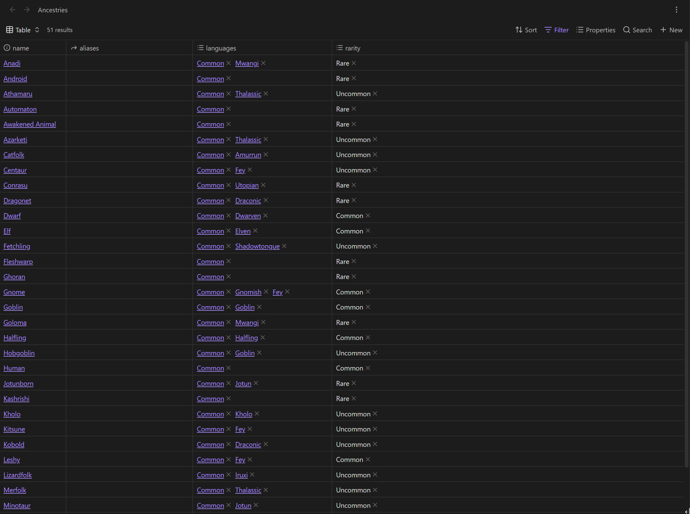

# Bases Utilities

Bases Utilities adds pagination, column search, and focused quality-of-life improvements to native Obsidian Bases. It works with the built-in views instead of replacing them.

## Features

- Turn the native **Limit number of results** value into a page size.
- Navigate with first, previous, next, and last page controls.
- Place pagination controls at the top, bottom, or both.
- Search an individual table column from its header.
- Get matching suggestions from values already present in the column.
- Treat each item in a list property as a separate suggestion.
- See a filter icon on a column while its search is active.
- Keep the native Bases toolbar, filters, sorting, grouping, editing, and rendering.

Pagination supports the native Table, Cards, and List layouts. Column search is available in Table layouts.

## Requirements

- Obsidian 1.13.0 or later

## Installation

### Community plugins

Once Bases Utilities is available in the Obsidian Community directory:

1. Open **Settings**.
2. Select **Community plugins**, then **Browse**.
3. Search for **Bases Utilities** and select **Install**.
4. Select **Enable**.

### Manual installation

1. Download `main.js`, `manifest.json`, and `styles.css` from the latest release.
2. Create `<Vault>/.obsidian/plugins/bases-utilities/`.
3. Copy the three downloaded files into that folder.
4. Reload Obsidian and enable **Bases Utilities** under **Settings → Community plugins**.

## Pagination

Open a native Table, Cards, or List view. Open the result-count menu and set **Limit number of results**. Bases Utilities uses that value as the number of items per page. Clear the native limit or choose **Show all** to disable pagination.

The command palette includes:

- **Bases Utilities: Toggle pagination in current base**
- **Bases Utilities: Go to first page in current base**

The toggle is session-only and does not edit the `.base` file.

Under **Settings → Bases Utilities**, choose whether pagination controls appear at the top, bottom, or both. The default is top.

## Column search

Select a table header to open a search box for that column. Matching is case-insensitive and filters results before pagination is applied.

As you type, the popup suggests values present in the column. The first match is selected automatically. Use the mouse, Up and Down arrow keys, or Enter to choose a suggestion. Items in list properties are suggested separately.

The active column displays a filter icon until the search is cleared.

Column search on left click is enabled by default. Disable **Open column search on left click** to restore native left-click sorting. **Search this column** remains available in the header's right-click menu.

## Compatibility

Bases Utilities integrates with internal native Bases behavior because Obsidian does not currently expose a public API for extending its built-in layouts. A future Obsidian update may require a compatibility update to the plugin.

## Privacy

Bases Utilities works locally. It does not collect telemetry or send vault data over the network.

## License

[MIT](LICENSE) © 2026 Bag of Tips
